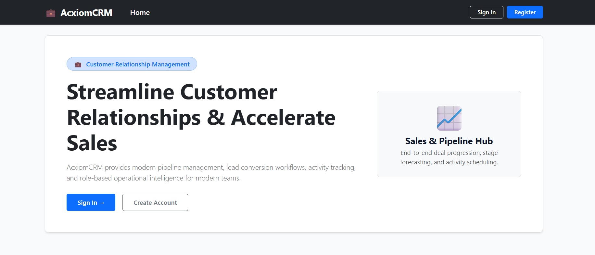
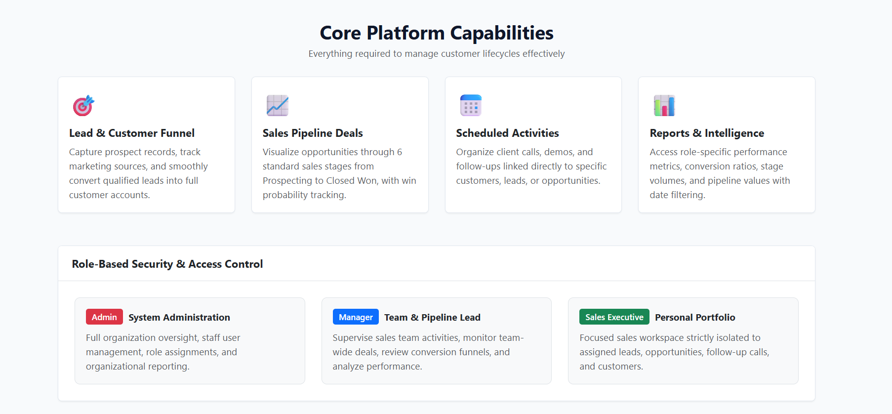
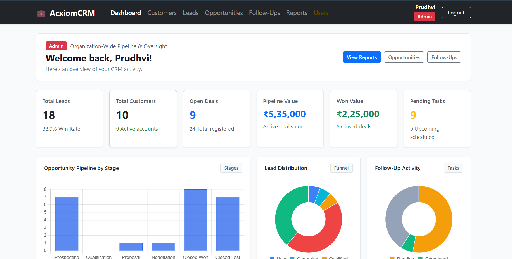
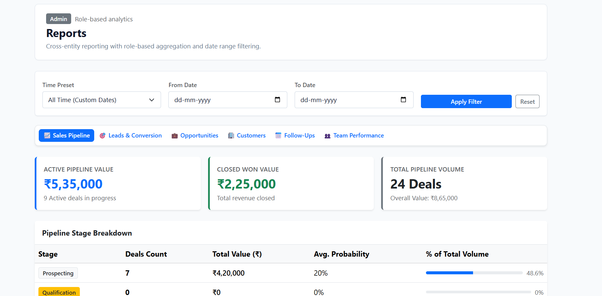
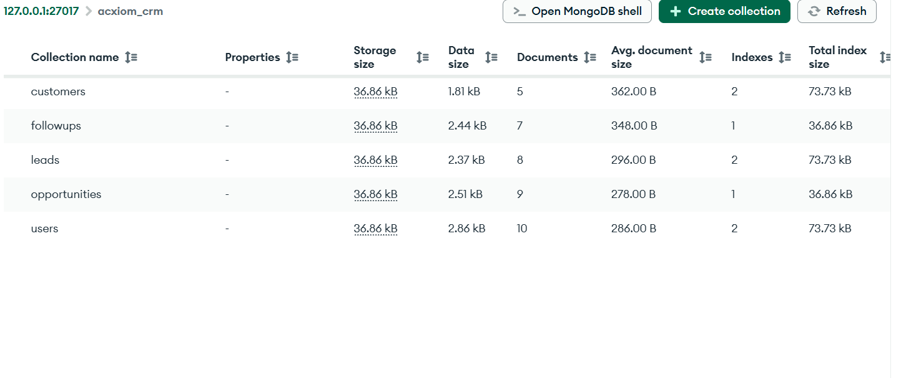

# AcxiomCRM — Customer Relationship Management System

A full-stack, role-based Customer Relationship Management (CRM) web application built using the **MERN** stack (MongoDB, Express.js, React, Node.js). Developed as a final-year B.Tech Computer Science & Engineering assignment for **Acxiom Consulting**, the system streamlines lead qualification, customer relationships, sales opportunity pipelines, and client activity scheduling with strict server-side Role-Based Access Control (RBAC).

---

## 📸 Application Screenshots

### 1. Modern Landing Page


### 2. Core Capabilities & Role Architecture


### 3. Role-Aware KPI Dashboard & Real-Time Charts


### 4. Interactive Reporting & Date Range Analytics


### 5. MongoDB Database Collections


---

## 🚀 Key Features

### 1. Authentication & Security
- **JWT Stateless Authentication**: Secure token generation (`jsonwebtoken`) with expiration.
- **Cryptographic Password Hashing**: Passwords hashed using `bcryptjs` with salt rounds before database persistence.
- **Brute-Force Account Protection**: Automatically locks accounts for 15 minutes after 5 consecutive failed login attempts.
- **Public Self-Registration**: Public users register with the default `Sales Executive` role. Attempts to self-assign `Admin` or `Manager` roles are strictly blocked with HTTP 400.
- **Session Verification**: `/api/auth/me` verifies tokens and returns active user profiles without exposing password hashes.

### 2. Role-Based Access Control (RBAC)
- **Admin**: Full organizational oversight, user management (create, update, toggle active status), all CRM data access, and organization reports. Admins are safeguarded from deactivating themselves.
- **Manager**: Team oversight, lead allocation, opportunity progression review, customer lists, and team-wide reporting. Cannot modify user accounts or roles.
- **Sales Executive**: Personal sales workspace strictly isolated to assigned leads, customers, opportunities, and follow-ups. Cannot access or modify other reps' records.

### 3. Lead Management & Conversion Funnel
- Complete CRUD operations for leads with contact info, lead source, and status tracking (`New`, `Contacted`, `Qualified`, `Lost`, `Converted`).
- **One-Click Lead-to-Customer Conversion**: Atomic workflow that creates an active `Customer` record, preserves lead attribution, updates the lead status to `Converted`, and prevents duplicate conversions.

### 4. Customer Management
- Complete customer directory with name, company, email, phone, address, and status (`Active`, `Inactive`).
- Dynamic search by customer name, company, or email with status filtering.
- Strict ownership enforcement where Sales Executives only manage accounts assigned to them.

### 5. Sales Opportunity Pipeline
- Track deals across 6 standard sales stages: `Prospecting`, `Qualification`, `Proposal`, `Negotiation`, `Closed Won`, and `Closed Lost`.
- Deal value tracking in INR (₹) with numeric probability percentage (0–100%).
- Automatic probability calibration: Moving to `Closed Won` sets probability to 100%; `Closed Lost` sets it to 0%.
- Validation preventing past close dates for active pipeline deals.

### 6. Scheduled Follow-Ups & Activities
- Schedule client interactions across activity types: `Call`, `Email`, `Meeting`, `Visit`, and `Other`.
- Status lifecycle: `Pending`, `Completed`, `Cancelled`.
- Multi-entity associations linking follow-ups to Customers, Leads, and Opportunities.

### 7. Interactive Dashboards & Analytics
- Role-aware KPI summary cards: Total Leads, Total Customers, Open Deals, Active Pipeline Value, Won Value, and Pending Tasks.
- Visual data representations using **Chart.js** and **react-chartjs-2**:
  - Opportunity Pipeline Deals by Stage (Bar chart)
  - Lead Distribution Funnel (Doughnut chart)
  - Follow-Up Activity Breakdown (Doughnut chart)

### 8. Cross-Entity Business Reports
- Dedicated reporting tabs for:
  - **Sales Pipeline Analysis** (Stage breakdown, deal counts, pipeline values, win ratios)
  - **Lead Conversion Report** (Conversion percentages by marketing channel)
  - **Opportunities Report** (Detailed deal register with stage filtering)
  - **Customer Reports** (Account activity summaries)
  - **Activity & Follow-Up Reports** (Completion metrics)
  - **Team Performance Report** (Manager/Admin-only rep activity analysis)
- **Flexible Date Filtering**: Preset filters (`Today`, `This Week`, `This Month`) and custom date ranges (`startDate` / `endDate`).

---

## 🛠️ Technology Stack & Student Rationale

| Layer | Technology | Rationale & Practical Justification |
|---|---|---|
| **Frontend** | React 18 + Vite | Modern functional components, hooks (`useState`, `useEffect`, `useContext`, `useCallback`), and lightning-fast Vite build system. |
| **Routing** | React Router v6 | Declarative client-side routing, protected route guards (`ProtectedRoute`), and active link styling. |
| **Styling** | Bootstrap 5 + Vanilla CSS | Clean, responsive grid system and styled components without third-party template bloat. Fully custom CSS tokens in `index.css`. |
| **Charts** | Chart.js + react-chartjs-2 | Lightweight, canvas-rendered charts for CRM pipeline and lead funnels. |
| **HTTP Client** | Axios | Centralized request instance (`api.js`) with request interceptors for JWT Bearer token injection and response error standardization. |
| **Backend** | Node.js + Express.js | Asynchronous, event-driven RESTful API architecture with modular routers, controllers, and error handlers. |
| **Database** | MongoDB + Mongoose 8 | Document-oriented database with schema-level validation, custom methods, pre-save middleware hooks, and aggregation pipelines. |
| **Security** | JWT + bcryptjs | Industry-standard cryptographic hashing and stateless Bearer token authorization. |

---

## 📁 Project Directory Structure

```text
AcxiomCRM/
├── images/                        # Application screenshots and documentation assets
│   ├── landing-hero.png
│   ├── capabilities-roles.png
│   ├── dashboard-analytics.png
│   ├── reports-filtering.png
│   └── mongodb-compass.png
│
├── server/                        # Backend REST API (Express + MongoDB)
│   ├── config/
│   │   └── db.js                  # Mongoose connection logic
│   ├── controllers/
│   │   ├── authController.js      # Register, login, lockout, logout, /me
│   │   ├── customerController.js  # Customer CRUD, search, role filtering
│   │   ├── dashboardController.js # Role-aware dashboard KPI aggregation
│   │   ├── followUpController.js  # Activity scheduling, updates, status
│   │   ├── healthController.js    # Health check & system diagnostics
│   │   ├── leadController.js      # Lead CRUD, assignment, conversion
│   │   ├── opportunityController.js # Deal pipeline, stage progression
│   │   ├── reportController.js    # Multi-entity report aggregations
│   │   └── userController.js      # Admin user management & RBAC
│   ├── middleware/
│   │   ├── authMiddleware.js      # JWT protect & authorizeRoles middleware
│   │   └── errorHandler.js        # Centralized 404 & error handlers
│   ├── models/
│   │   ├── Customer.js            # Customer Mongoose schema
│   │   ├── FollowUp.js            # Follow-up activity schema
│   │   ├── Lead.js                # Lead funnel schema with conversion ref
│   │   ├── Opportunity.js         # Opportunity deals schema with stage enum
│   │   └── User.js                # User schema with bcrypt & lockout methods
│   ├── routes/
│   │   ├── authRoutes.js          # /api/auth endpoints
│   │   ├── customerRoutes.js      # /api/customers endpoints
│   │   ├── dashboardRoutes.js     # /api/dashboard endpoints
│   │   ├── followUpRoutes.js      # /api/followups endpoints
│   │   ├── healthRoutes.js        # /api/health endpoint
│   │   ├── leadRoutes.js          # /api/leads endpoints
│   │   ├── opportunityRoutes.js   # /api/opportunities endpoints
│   │   ├── reportRoutes.js        # /api/reports endpoints
│   │   └── userRoutes.js          # /api/users endpoints (Admin only)
│   ├── scripts/
│   │   ├── seed.js                # Realistic database seeder
│   │   ├── runAllTests.js         # Master test runner
│   │   ├── testPhase2.js          # Auth & RBAC test suite (22 tests)
│   │   ├── testPhase3.js          # Customer & Lead test suite (25 tests)
│   │   ├── testPhase4.js          # Opportunity & Follow-Up test suite (27 tests)
│   │   ├── testPhase5.js          # Dashboard & Reports test suite (25 tests)
│   │   ├── testRegisterFlow.js    # Registration security test suite (14 tests)
│   │   └── testEndToEndWorkflow.js # Complete CRM business lifecycle (29 tests)
│   ├── utils/
│   │   ├── auditLogger.js         # Structured audit logging utility
│   │   ├── dateFilter.js          # Date range and preset parser
│   │   └── jwt.js                 # JWT sign and verification helpers
│   ├── .env.example               # Server environment variables template
│   ├── package.json               # Backend dependencies & scripts
│   └── server.js                  # Express application entry point
│
├── client/                        # Frontend Single-Page App (React + Vite)
│   ├── src/
│   │   ├── components/
│   │   │   ├── Footer.jsx         # Global footer with system status
│   │   │   ├── Layout.jsx         # App layout wrapper
│   │   │   ├── Navbar.jsx         # Navigation bar with role badges & links
│   │   │   └── ProtectedRoute.jsx # Client-side route & RBAC guard
│   │   ├── context/
│   │   │   └── AuthContext.jsx    # React Context for session management
│   │   ├── pages/
│   │   │   ├── CustomerListPage.jsx   # Customer management page
│   │   │   ├── DashboardPage.jsx      # Role-based KPI dashboard with charts
│   │   │   ├── FollowUpListPage.jsx   # Activities & follow-ups page
│   │   │   ├── HomePage.jsx           # Product landing page
│   │   │   ├── LeadListPage.jsx       # Lead funnel & conversion page
│   │   │   ├── LoginPage.jsx          # User sign-in page
│   │   │   ├── NotFoundPage.jsx       # 404 error page
│   │   │   ├── OpportunityListPage.jsx# Sales deals pipeline page
│   │   │   ├── RegisterPage.jsx       # Public account creation page
│   │   │   ├── ReportsPage.jsx        # Reporting & analytics page
│   │   │   └── UserManagementPage.jsx # Admin user directory & role controls
│   │   ├── services/
│   │   │   └── api.js                 # Central Axios API service methods
│   │   ├── App.jsx                    # Route hierarchy & protection
│   │   ├── index.css                  # Custom design system & styles
│   │   └── main.jsx                   # React root entry point
│   ├── .env.example                   # Client environment variables template
│   ├── package.json                   # Frontend dependencies & scripts
│   └── vite.config.js                 # Vite configuration
│
├── .gitignore                         # Git ignore configuration
└── README.md                          # Comprehensive project documentation
```

---

## 🔐 Role Permissions Matrix

| Module / Action | Admin | Manager | Sales Executive |
|---|:---:|:---:|:---:|
| **Register Account** | Via Admin Panel | Via Admin Panel | Public Sign Up (`/register`) |
| **User Management** | Full CRUD | ❌ Forbidden | ❌ Forbidden |
| **Activate/Deactivate User** | Yes (Cannot self-deactivate) | ❌ Forbidden | ❌ Forbidden |
| **View Customers** | All Customers | All Customers | Assigned Customers Only |
| **Create Customer** | Yes | Yes | Yes (Auto-assigned to self) |
| **Delete Customer** | Yes | Yes | ❌ Forbidden |
| **View Leads** | All Leads | All Leads | Assigned Leads Only |
| **Create Lead** | Yes | Yes | Yes |
| **Assign/Reassign Lead** | Any Rep | Any Rep | ❌ Forbidden |
| **Convert Lead to Customer** | Yes | Yes | Assigned Leads Only |
| **Opportunities Pipeline** | Organization-wide | Team-wide | Assigned Deals Only |
| **Follow-Up Activities** | Organization-wide | Team-wide | Assigned Activities Only |
| **Dashboard Metrics** | Organization Scope | Team Scope | Personal Rep Scope |
| **Standard Reports** | Yes | Yes | Assigned Scope |
| **User Performance Report** | Yes | Yes | ❌ Forbidden (HTTP 403) |

---

## 👥 Demo Credentials (Seeded)

The repository includes a database seed script (`npm run seed` in `server`) that seeds initial accounts for evaluation:

| Role | Email | Password | Access Scope |
|---|---|---|---|
| **Admin** | `admin@acxiom.com` | `Admin@123` | System Administration & Organization Oversight |
| **Manager** | `manager@acxiom.com` | `Manager@123` | Team Lead & Pipeline Oversight |
| **Sales Executive** | `sales@acxiom.com` | `Sales@123` | Personal Portfolio & Client Execution |

---

## 🚀 How to Set Up and Run Locally

### Prerequisites
- **Node.js**: v18.x or v20.x or v22.x
- **npm**: v9.x or v10.x
- **MongoDB**: Community Server running locally on `mongodb://127.0.0.1:27017` (or MongoDB Atlas URI)

### 1. Clone the Repository
```bash
git clone https://github.com/prudhvi-raju-jubburu/AcxiomCRM.git
cd AcxiomCRM
```

### 2. Configure Environment Files

**Backend:**
Copy `server/.env.example` to `server/.env`:
```env
PORT=5000
MONGODB_URI=mongodb://127.0.0.1:27017/acxiom_crm
CLIENT_URL=http://localhost:5173
NODE_ENV=development
JWT_SECRET=acxiom_crm_recruitment_jwt_secret_key_2026
JWT_EXPIRE=7d
```

**Frontend:**
Copy `client/.env.example` to `client/.env`:
```env
VITE_API_BASE_URL=http://localhost:5000/api
```

### 3. Install Dependencies & Seed the Database

**Backend Setup:**
```bash
cd server
npm install
npm run seed       # Populates demo users, leads, customers, deals, and follow-ups
```

**Frontend Setup:**
```bash
cd ../client
npm install
```

### 4. Start the Application

**Terminal 1 — Backend API:**
```bash
cd server
npm run dev
# Server running at http://localhost:5000
# Connected to MongoDB: mongodb://127.0.0.1:27017/acxiom_crm
```

**Terminal 2 — Frontend Application:**
```bash
cd client
npm run dev
# Vite server running at http://localhost:5173 or http://localhost:5174
```

Visit `http://localhost:5173` (or the port displayed in your terminal) in your browser.

---

## 🧪 Automated Testing

The project includes **142 automated tests** covering security, RBAC, business workflows, and edge cases.

To execute all test suites simultaneously:
```bash
cd server
npm test
```

### Test Suite Summary:

```text
====================================================
ACXIOM CRM - MASTER AUTOMATED TEST SUITE RUNNER
====================================================

[1/6] Phase 2: Authentication & RBAC (testPhase2.js)
  --> PASSED (22 tests passed, 0 failed)

[2/6] Phase 3: Customer & Lead Management (testPhase3.js)
  --> PASSED (25 tests passed, 0 failed)

[3/6] Phase 4: Opportunities & Follow-Ups (testPhase4.js)
  --> PASSED (27 tests passed, 0 failed)

[4/6] Phase 5: Dashboard & Analytics (testPhase5.js)
  --> PASSED (25 tests passed, 0 failed)

[5/6] Registration & Security Flow (testRegisterFlow.js)
  --> PASSED (14 tests passed, 0 failed)

[6/6] End-to-End Business Lifecycle Workflow (testEndToEndWorkflow.js)
  --> PASSED (29 tests passed, 0 failed)

====================================================
OVERALL SUMMARY: 6 Suites Passed, 0 Failed (142 Total Tests)
====================================================
```

### Production Build Verification
To verify the frontend production bundle:
```bash
cd client
npm run build
# vite build completed with 0 errors (dist/ generated)
```

---

## 🔄 End-to-End CRM Business Workflow

The application supports the complete commercial sales cycle:

```text
  [Self-Registration] (/register)
          │
          ▼
   [Authentication] (/login) ──► JWT Bearer Token Issued
          │
          ▼
   [Personal Dashboard] (/dashboard) ──► Initial KPI Inspection
          │
          ▼
    [Create Lead] (/leads) ──► Status: "New", Source: "Website"
          │
          ▼
    [Qualify Lead] (/leads/:id) ──► Status updated to "Qualified"
          │
          ▼
  [Lead Conversion] (/leads/:id/convert) ──► Lead marked "Converted"
          │
          ▼
  [Customer Created] (/customers/:id) ──► Active Customer account generated
          │
          ▼
  [Create Opportunity] (/opportunities) ──► Linked Deal (Stage: "Proposal", ₹1,50,000)
          │
          ▼
  [Schedule Follow-Up] (/followups) ──► Activity scheduled for commercial review
          │
          ▼
  [Complete Follow-Up] (/followups/:id) ──► Status marked "Completed" with notes
          │
          ▼
  [Close Deal (Won)] (/opportunities/:id) ──► Stage: "Closed Won" (Probability: 100%)
          │
          ▼
 [Dashboard & Reports] (/dashboard & /reports) ──► Revenue, deals & win rates updated!
```

---

## 📡 REST API Reference

### Authentication (`/api/auth`)
- `POST /api/auth/register` — Public registration (defaults to Sales Executive)
- `POST /api/auth/login` — Sign in and issue JWT (lockout on 5 failures)
- `POST /api/auth/logout` — Revoke session
- `GET /api/auth/me` — Authenticated user profile

### User Administration (`/api/users`) — Admin Only
- `GET /api/users` — List users with pagination and search
- `POST /api/users` — Create user with designated role
- `GET /api/users/:id` — View user profile
- `PUT /api/users/:id` — Update user details or role
- `PATCH /api/users/:id/status` — Toggle active status (self-deactivation prevented)

### Customers (`/api/customers`)
- `GET /api/customers` — List customers (role-filtered for Sales Executives)
- `POST /api/customers` — Create customer
- `GET /api/customers/:id` — Customer details
- `PUT /api/customers/:id` — Update customer
- `DELETE /api/customers/:id` — Delete customer (Admin & Manager only)

### Leads (`/api/leads`)
- `GET /api/leads` — List leads (role-filtered for Sales Executives)
- `POST /api/leads` — Create lead
- `GET /api/leads/:id` — Lead details
- `PUT /api/leads/:id` — Update lead status and details
- `DELETE /api/leads/:id` — Delete lead (Admin & Manager only)
- `POST /api/leads/:id/convert` — Convert qualified lead into Customer

### Opportunities (`/api/opportunities`)
- `GET /api/opportunities` — List deals (role-filtered for Sales Executives)
- `POST /api/opportunities` — Create sales opportunity
- `GET /api/opportunities/:id` — Opportunity details
- `PUT /api/opportunities/:id` — Update stage, amount, probability
- `DELETE /api/opportunities/:id` — Delete deal (Admin & Manager only)

### Follow-Ups (`/api/followups`)
- `GET /api/followups` — List scheduled activities
- `POST /api/followups` — Schedule new interaction
- `GET /api/followups/:id` — Follow-up details
- `PUT /api/followups/:id` — Update status (`Completed`, `Cancelled`) and notes
- `DELETE /api/followups/:id` — Delete follow-up

### Dashboard & Analytics (`/api/dashboard`)
- `GET /api/dashboard/summary` — Role-aware KPI counts, pipeline values, and chart datasets

### Reporting (`/api/reports`)
- `GET /api/reports/pipeline` — Sales pipeline stage breakdown
- `GET /api/reports/conversion` — Lead-to-customer conversion metrics by channel
- `GET /api/reports/opportunities` — Opportunity registry and values
- `GET /api/reports/customers` — Customer activity summaries
- `GET /api/reports/followups` — Activity completion metrics
- `GET /api/reports/user-performance` — Rep performance breakdown (Admin & Manager only)

### System Diagnostics
- `GET /api/health` — Public uptime and MongoDB connectivity check

---

## 🎓 Final-Year B.Tech Viva / Interview Preparation

During an interview, a student can clearly articulate every aspect of this project:

1. **Why MERN?**
   - JavaScript across both client and server reduces context switching.
   - Non-blocking I/O in Node.js handles concurrent I/O operations smoothly.
   - JSON-like BSON documents in MongoDB map directly to React state objects.

2. **How does RBAC work?**
   - **Backend**: Every request is intercepted by `protect` middleware to verify the JWT token and load the active user from MongoDB. `authorizeRoles('Admin', ...)` verifies permissions before passing execution to the controller.
   - **Database queries**: For Sales Executives, query filters automatically append `{ assignedTo: req.user._id }`, preventing horizontal privilege escalation at the database layer.
   - **Frontend**: The `ProtectedRoute` component validates session state and role permissions, redirecting unauthorized users or rendering an Access Denied barrier.

3. **How does Lead Conversion work?**
   - An endpoint `/api/leads/:id/convert` performs atomic operations: verifies lead eligibility, creates a new `Customer` record, assigns it to the same rep, and updates the lead status to `Converted` with a reference to the customer.

4. **Security Highlights**:
   - `bcryptjs` salt rounds for irreversible password storage.
   - Passwords excluded by default using Mongoose `select: false`.
   - Account lockout mechanism preventing brute-force dictionary attacks.
   - Public registration restricted from elevating to privileged roles.

---

## 📄 License
This project was developed for academic and recruitment evaluation purposes for **Acxiom Consulting**.
